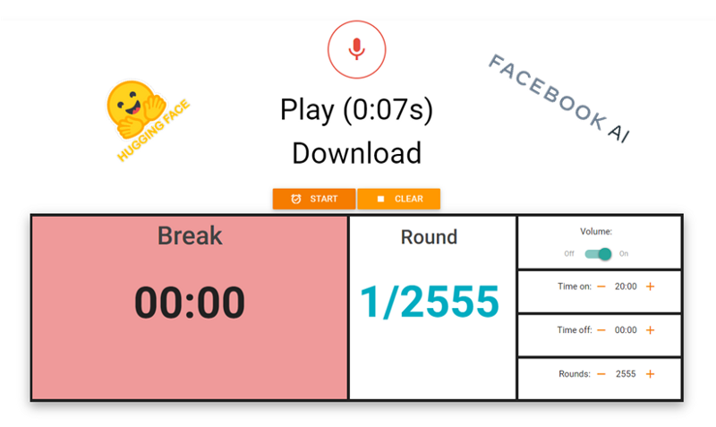
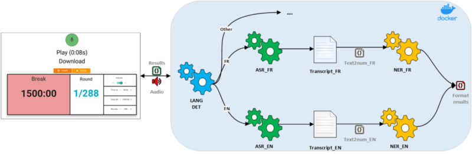

## Voice Enabled Sport Interval Timer using Transformers models



### Toolset

- Flair is a library on top of Transformers, used to train top notch NER models.
- Speechbrain pretrained models manually selected from HuggingFace based on performance.
- Text2num to convert text digits to numbers.

### The app
The app supports for now only English and French, it uses 5 models:
- Language detector: Speechbrain pre-trained from [HF](https://huggingface.co/speechbrain/lang-id-commonlanguage_ecapa)
- English ASR: Speechbrain Wav2vec2 model fine-tuned on commonvoice EN dataset from [HF](https://huggingface.co/speechbrain/asr-wav2vec2-commonvoice-en)
- French ASR: Speechbrain Wav2vec2 model fine-tuned on commonvoice FR dataset from [HF](https://huggingface.co/speechbrain/asr-wav2vec2-commonvoice-fr)
- Custom French NER: Fine-tuned camembert-base model, trained using Flair, deployed in [HF](https://huggingface.co/amtam0)
- Custom English NER: Fine-tuned distilroberta-base model, trained using Flair, deployed in [HF](https://huggingface.co/amtam0)

Dataset for NER was built manually, using simple sentences to interact with the timer to be filled up:

Sentences example:
```
19 sets of 3 minutes 21 minutes between sets
start 7 sets of 32 seconds
create 13 sets of 26 seconds
init 8 series of 3 hours
2 sets of 30 seconds 35 minutes between each cycle
...
```

Results, models architecture and parameters, training logs and datasets can be found in [HF](https://huggingface.co/amtam0)



for the UI, used codepen templates (references below).

Demo link, based on 10 sec input audio file:
- `index` (only English) deployed on Cloud Run, ~6 sec response time. 
- `indexgpu` (EN+FR) ~below 1 sec response time using Gpu.

Tested on i7 8700k cpu : response time is around 2 seconds.

### To build & deploy locally
1. Clone the repo
2. Build Docker image : `docker build -t <REPOSITORY-NAME>/<IMAGE>:<TAG> .`
2. Deploy locally : Run Docker image and check if Api is working by running http://localhost:10000
    - CPU : `docker run -it -v -p 10000:80 <REPOSITORY-NAME>/<IMAGE>:<TAG>`
    - GPU : `docker run -it --gpus all -p 10000:80 <REPOSITORY-NAME>/<IMAGE>:<TAG>`

### Limits and Areas for improvements
- NER:
    - Dataset is simple but is easily optimisable, can be more generic
    - Error handling Ex. duplicate entities, out of context, ASR errors...
- ASR limitations : big models, slow inference on cpu
    - Explore ditributed inference on cpu, and model compression
- Webapp UI Smartphone : timer stops after dozen seconds when screen is off (HTML5 running apps when screen off is not supported yet)

### References
- Huggingface https://huggingface.co/models
- Flair https://github.com/flairNLP/flair
- Speechbrain https://github.com/speechbrain/speechbrain
- Recorder JS https://codepen.io/robert_bakiev/pen/VpoLYo
- Timer JS https://codepen.io/LauraNK/pen/rxWLMy
- Text2num https://github.com/allo-media/text2num